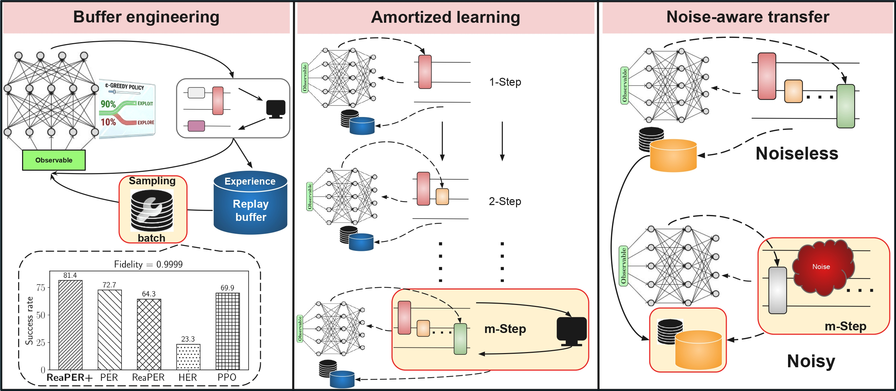
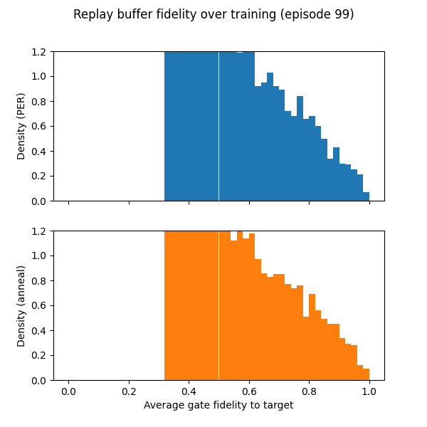
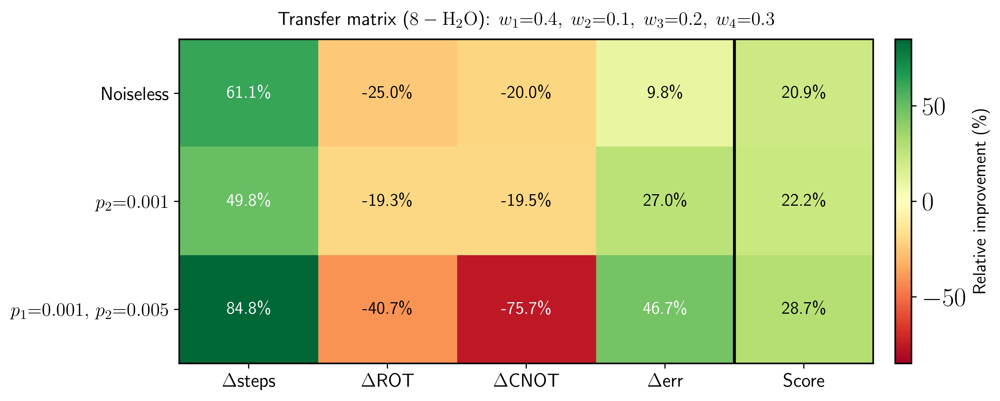
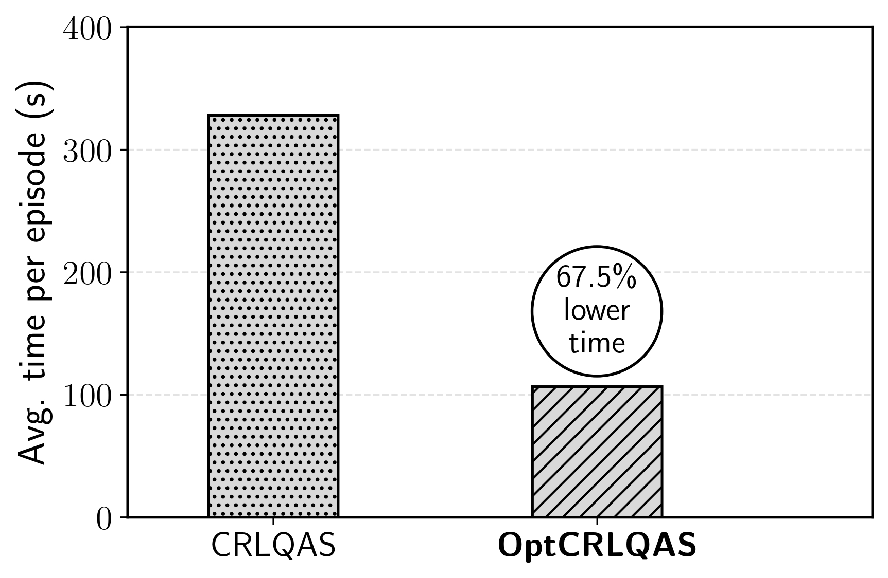

# Annealed replay and buffer transfer for noise-robust quantum circuit optimization
### (An amortized curriculum reinforcement learning approach)
------------------
<h1 align="center"> Preprint <h1>

<p align="center">
  
</p>


## Running code
```
conda create -n {name_your_environment} python=3.10
conda activate {name_your_environment}
pip install -r requirements.txt
```

## Quantum compiling

**(Kindly use `-h` at the end of each python script to see all available options for setting arguments)**

For the 1-qubit compiling with action space consisting of $\texttt{RX}, \texttt{RY}, \texttt{RZ}$ with $\pm\pi/128$ angle simple run:

```
python compiling/main_1q_small_rot.py --replay CHOOSE_BUFFER
```

$\text{CHOOSE\_BUFFER}\in$ \{'per', 'reaper','her' or 'reaper_anneal'\}$. So for **ReaPER+** you simple run the following:
```
python compiling/main_1q_small_rot.py --replay reaper_anneal
```

For 1-qubit [HRC gateset](https://arxiv.org/abs/quant-ph/0111031) simply run (say with **ReaPER**):
```
python compiling/main_1q_hrc.py --replay reaper
```
Finally for 2-qubit compiling just run (say with **PER**):
```
python compiling/main_2q.py --replay per
```

## Quantum architecture search

The RL-algorithm is isnpired by [CRLQAS](https://openreview.net/forum?id=rINBD8jPoP) but with `m` **step ammortization** and **replay buffer transfer**. Further discussed in **Whats New?** below.


## Whats New?
----------

### 🔁 **ReaPER+ (Annealed prioritized experience replay)**

- **Smoothly transitions** from TD-error-driven prioritization (PER, https://arxiv.org/abs/1511.05952) to reliability-aware sampling (ReaPER, https://iclr.cc/virtual/2026/poster/10008022) over the course of training.

<p align="center">
  
</p>

- **Outperforms** fixed PER, ReaPER, HER, and PPO baselines on 1- and 2-qubit quantum compilation tasks, achieving up to 4× gains in sample efficiency and consistently discovering shorter circuits.

- **Validated beyond the quantum domain on the classical LunarLander-v3** benchmark, achieving a 9% AUC improvement over both PER and fixed ReaPER — confirming the annealing principle is domain-agnostic

### 🔀 **Lightweight replay-buffer transfer for noisy settings**

- **A weight-free buffer transfer scheme** that reuses noiseless trajectories to warm-start RL training in depolarizing-noise environments — without transferring network weights or reward relabeling.
<p align="center">
  
</p>

- **Reduces steps to chemical accuracy** by up to 85–90% and improves final energy error by up to 90% over from-scratch noisy baselines on 6-, 8-, and 12-qubit molecular tasks (such as BeH₂, H₂O).

- **Transfer advantage scales with system size:** at 12 qubits under combined depolarizing noise, buffer transfer reduces steps by 88.2% and achieves the highest composite transfer score of 51.0 across all benchmarks.

### ⚡ OptCRLQAS: Amortized curriculum learning

- Batches $m$ architectural edits before triggering a single quantum-classical evaluation, reducing wall-clock time per episode by up to 67.5% on 12-qubit H₂O without loss in accuracy.
<p align="center">
  
</p>
- Cuts quantum circuit simulation time by up to 89% and classical optimization time by up to 85%.


### 📈 Improvement over nonRL baselines

| Problem    | Method                        | Min error (Ha)        | Total gates | CNOT |
|------------|-------------------------------|-----------------------|-------------|------|
| 5-Heisenberg | **OptCRLQAS + ReaPER+ (ours)** | **5.9 × 10⁻⁴**   | **41**      | NA   |
|            | [DQAS](https://iopscience.iop.org/article/10.1088/2058-9565/ac87cd/meta)                     | 1.1 × 10⁻¹            | 35          | NA   |
|            | [GQAS](https://www.sciencedirect.com/science/article/pii/S0893608024004325)                     | 7.1 × 10⁻⁴            | 35          | NA   |
|            | [TF-QAS](https://ojs.aaai.org/index.php/AAAI/article/view/29135)                   | 1.2 × 10⁻³            | 35          | NA   |
| 6-BEH₂     | **OptCRLQAS + ReaPER+ (ours)** | **5.8 × 10⁻⁵**   | **54**      | **12** |
|            | [TF-QAS](https://ojs.aaai.org/index.php/AAAI/article/view/29135)                   | 1.8 × 10⁻³            | 57          | NA   |
|            | [SA-QAS](https://proceedings.mlr.press/v202/lu23f.html)                   | 5.6 × 10⁻³            | 73          | 45   |
| 8-H₂O      | **OptCRLQAS + ReaPER+ (ours)** | **1.2 × 10⁻⁴**   | **134**     | **52** |
|            | [quantumDARTS](https://proceedings.mlr.press/v202/wu23v.html)             | 1.7 × 10⁻⁴            | 219         | 68   |
|            | [SA-QAS](https://proceedings.mlr.press/v202/lu23f.html)                   | 2.6 × 10⁻³            | 95          | 69   |
